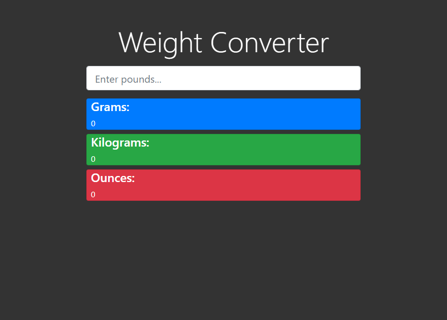

# Project Name

This is a practice project on creating a weight converter app, where a user can choose a weight unit and enter the amount and the app will convert the given amount to an equivalent unit weight of choice.

Additional description about the project and its features.

## Built With

- Javascript(ES6)
- HTML
- CSS
- Webpack
- Bootstrap 4.0

## Live Demo

<a href="https://emmanuelkamala.github.io/WeightConverter/">Live Version</a>

## Getting Started

To get a local copy up and running follow these simple example steps.

### Prerequisites
You need to have a web browser

### Setup

# Install
- Clone the repo
- Run 'npm install' command to install package dependencies.

# Run the index file

To run the index file and see the project; enter this command on the command line:
'npm run start'

Then open the browser and enter this link:
http://localhost:8080

## Authors

👤 **Author**

- Github: [@githubhandle](https://github.com/emmanuelkamala)
- Twitter: [@twitterhandle](https://twitter.com/ejkamala)
- Linkedin: [linkedin](https://linkedin.com/in/emmanuelkamala)

